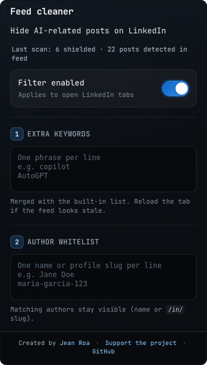
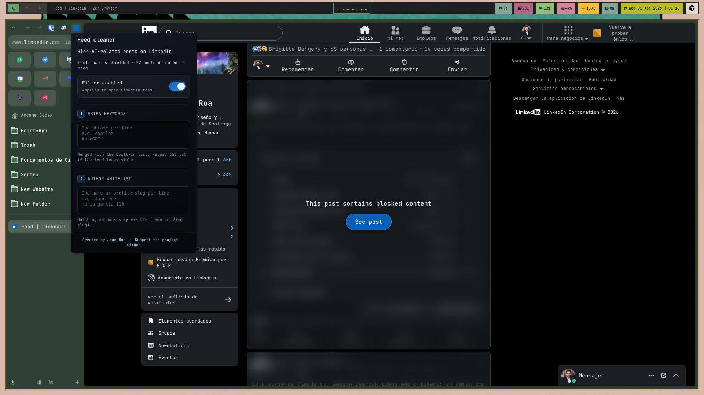

<div align="center">

<br/>

### ✦ ·˖° **feed cleaner for linkedin** °˖· ✦

<sub>☆ manifest v3 · vanilla js · zero runtime bundler ☆</sub>

<br/>


<br/>

| ✧ | status | ✧ |
|:---:|:---|:---:|
| build | `no webpack` | ✓ |
| vibes | `y2k compliant` | ✓ |

<br/>


<br/>

</div>

---

## ▸ what it does

Browser extension (**Chromium MV3** + **Firefox** / Zen) — **Feed cleaner for LinkedIn** — that **covers** matching feed cards on `linkedin.com` with a **blur overlay**. The overlay shows *“This post contains blocked content”* and a **See post** button; clicking it removes the blur for that card (remembered for the session via a stable post fingerprint).

- **Matching:** built-in AI/ML-related keyword list + **extra keywords** (one phrase per line in the popup). Case-insensitive; Unicode “fancy” Latin is folded before checks (see below).
- **Author whitelist:** optional list of names or profile slugs (`/in/…`). If a post matches blocked keywords but the **author** matches a whitelist line, the card **stays visible**.
- **State:** `storage.local` (`filterEnabled`, `customKeywords`, `authorWhitelist`, scan stats). After save, the popup uses **`tabs.sendMessage`** so open LinkedIn tabs pick up settings (**Chromium** + **Gecko**).

<div align="center">

<br/>



<sub>popup</sub>

<br/>



<sub>feed</sub>

<br/>

</div>

---

## ▸ built-in keyword list

Matching is case-insensitive; Unicode “fancy” Latin (e.g. mathematical italics) is folded to ASCII before checks.  
Custom lines from the popup are **substring** matches (one phrase per line), except a line that is exactly `ai` or `ia`, which uses **whole-word** matching like the built-ins below.

### Whole words only

These do **not** match inside longer words (e.g. not `email`, `inicia`):

| Source | Tokens |
|:---|:---|
| `PHRASES` | `ai`, `ia` |
| `SHORT_PATTERNS` (regex `\b…\b`) | `ml`, `llm`, `llms`, `rag`, `agi` |

### Substring phrases (`PHRASES`)

If the post text contains any of these (after normalization), the card gets the **blur shield** until you click **see post** (or you turn the filter off):

```
artificial intelligence
inteligencia artificial
machine learning
aprendizaje automático
deep learning
large language model
language model
generative ai
generative artificial
gen ai
genai
chatgpt
chat gpt
gpt-4
gpt-3
gpt 4
gpt 3
gpt4
gpt3
openai
anthropic
claude
midjourney
dall-e
dall·e
stable diffusion
prompt engineering
ingeniería de prompts
copilot
github copilot
google gemini
gemini pro
google bard
neural network
neural networks
redes neuronales
fine-tuning
finetuning
fine tuning
retrieval augmented
rag pipeline
multimodal model
diffusion model
transformer model
whisper
embedding model
vector database
langchain
haystack
hugging face
mistral ai
cohere
perplexity ai
```

Canonical list lives in **`content.js`** (`PHRASES` + `SHORT_PATTERNS`).

---

## ▸ stack 〜 file map

| layer | files |
|:---|:---|
| chrome (UI) | `popup.html` · `popup.css` · `popup.js` |
| page | `content.js` · `content.css` |
| legacy MV2 | `manifest-firefox-v2.json` · `background.js` |
| ship icon | `icon.png` |
| qa | `npm run lint:firefox` · `npm run pack:temp` |

<details>
<summary><b>⋆ repo tree (expand) ⋆</b></summary>

```
manifest.json
manifest-firefox-v2.json
content.js / content.css
popup.html / popup.css / popup.js
background.js
icon.png
assets/app.png        ← popup screenshot (readme)
assets/screenshot.png ← feed screenshot (readme)
assets/*.gif          ← readme eye candy + swap in your own demos
LICENSE · CONTRIBUTING.md
```

</details>

---

<div align="center">


</div>

---

## ▸ local dev

```bash
npm install
npm run lint:firefox
```

| browser | how |
|:---|:---|
| **Chrome** | `chrome://extensions` → Load unpacked → this folder (`manifest.json`) |
| **Firefox / Zen** | `npm run pack:temp` → load `.xpi` in `about:debugging` **or** fix Flatpak portal ([bug 1639530](https://bugzilla.mozilla.org/show_bug.cgi?id=1639530)) |

---

## ▸ permissions (honest list)

- `storage` — filter toggle, custom keywords, author whitelist, last-scan stats  
- `tabs` — notify LinkedIn tabs after popup save  
- host `https://www.linkedin.com/*` · `https://linkedin.com/*` — inject content script  

---

## ▸ versions & releases

- **Current release:** `1.3.0` — see **[CHANGELOG.md](CHANGELOG.md)** (author whitelist, blur/stacking fixes vs LinkedIn overlays, popup copy/layout, store-facing name **Feed cleaner for LinkedIn**).
- **SemVer** — `package.json`, `manifest.json`, and `manifest-firefox-v2.json` must share the same `version`. Check with `npm run verify:version`.
- **[RELEASING.md](RELEASING.md)** — bump, tag (`v1.3.0`), GitHub Release, stores.
- Pushing a tag **`v*.*.*`** runs **GitHub Actions**: lint, build, attach `web-ext-artifacts/*.zip` to the release.

---

## ▸ collab

- **[CONTRIBUTING.md](CONTRIBUTING.md)** — PR + issue rules  
- **[LICENSE](LICENSE)** — MIT  

---

<div align="center">

```
·:*¨༺ ♱ ✧ ✦ ✧ ♱ ༻¨*:·
```

<br/>

**[jeanroa.dev](https://jeanroa.dev)** · **[support the project](https://buymeacoffee.com/jeanroa)** · **[github](https://github.com/drakvyn/feed-fleaner-for-linkedIn)**

<br/>

</div>
